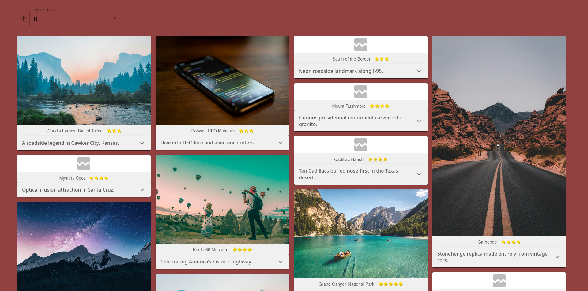

### HOW TO RUN:
Repo has two final branches, one for locally running, and one for running with the fetched data mocked in cypress e2e
Clone either one and follow the instructions:
Local branch:
>pnpm i
then
>pnpm run dev
or
>pnpm run prod
And open up the printed localhost webserver url in any browser

Cypress branch (master):
>pnpm i
then
>pnpm run e2e
or
>pnpm run cypress

# Current state:
Latest Cypress:

# Notes:
1. Semantic html / Material UI split.
2. Not sure if it was part of the test, but even inside of the JSON code block the resulting pdf would linebreak the long description rendering the JSON invalid until some vim macro magic was applied.
3. Checked unsplash 404s, all url's have the same length, no non ascii characters, taken down or purposefully altered?
4. Modal can be implemented with react createPortal, with the material portal wrapper of createPortal, or the material modal wrapper of the material portal wrapper.
5. Nested ternaries can be switched out for if/else blocks or switch statements, up to preference of the employer

# Questions:
1. File structure of react components with SCSS?
2. Referencing css in JSX (CSS-in-JSS or other way)?
3. Any particularly important libraries I should know of on the job? State management, UI libraries, Data fetching, Error Handling, etc.
4. Thoughts on compiler?
5. Which package manager?

# References:
1. https://css-tricks.com/using-styling-the-details-element/
2. https://docs.imgix.com/en-US/apis/rendering/overview
3. https://css-tricks.com/the-complete-guide-to-lazy-loading-images/
4. Material UI docs, MDN for everything else html/css related
5. Cypress reference